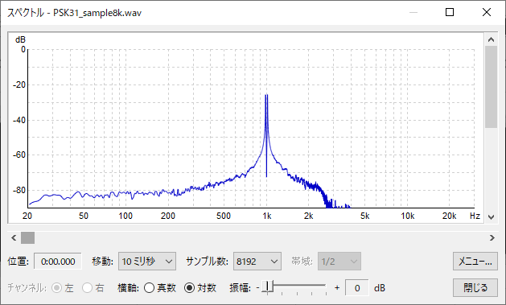

# Demodulation PSK31 in Python
This is a Python program to demodulate the psk31 known as QPSK modulation.
This is the simplest example, and only the Terminal Unit part of the psk31 is implemented. See also https://en.wikipedia.org/wiki/PSK31

## Source code
~~~
import wave
import math
import numpy as np

fname='psk31_sample8k.wav'  # should be specify the filename.
smp= 8000           # Sampling Rate
FQ= smp/1000.0      # Signal Frequency 
wind= 40            # window
waveFile = wave.open(fname, 'r')
q=[];i=[]
for j in range(waveFile.getnframes()):
      buf = waveFile.readframes(1)
      q.append((buf[0]-128)*np.sin(np.pi*2.0/FQ*j))
      i.append((buf[0]-128)*np.cos(np.pi*2.0/FQ*j))
      print(int(sum(q)>0),int(sum(i)>0),sep=",")
      if j>wind:q.pop(0);i.pop(0)
waveFile.close()
~~~
## Sample sound file
should be convet to wave format.
The input audio file should have a sampling rate of 8000 Hz and a quantization bit rate of unsigned 8 bits.

https://en.wikipedia.org/wiki/File:PSK31_sample.ogg

it is from wikipedia of psk31. If you decode it, it becomes "Welcome to Wikipedia, the free encyclopedia that anyone can edit." 
      
## Parameters
Some parameters in the source code need to be modified according to the audio file to be input. 
~~~
fname='psk31_sample8k.wav'  # should be specify the filename.
smp= 8000           # Sampling Rate
FQ= smp/1000.0      # Signal Frequency 
~~~
- fname   
should be specify the filename.
- smp   
Sampling Rate.
- FQ
Signal Frequency. This sound example should be 1000.0.     
This figure shows the spectral distribution of a sample sound file. There is a peak around 1000Hz.

      
## Complex Plane and Value Assignment
Modify this line if you want to change the value assignment for the complex plane.      
~~~
print(int(sum(q)>0),int(sum(i)>0),sep=",")
~~~      
## Usage
Please specify an appropriate audio file for the input.
This program assumes 8KHz sampling, mono, 8bit quantization, and no sign.
~~~
 python psk31.py > psk31_sample8k.csv
~~~
Demodulation example

